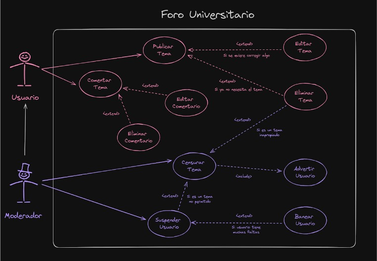
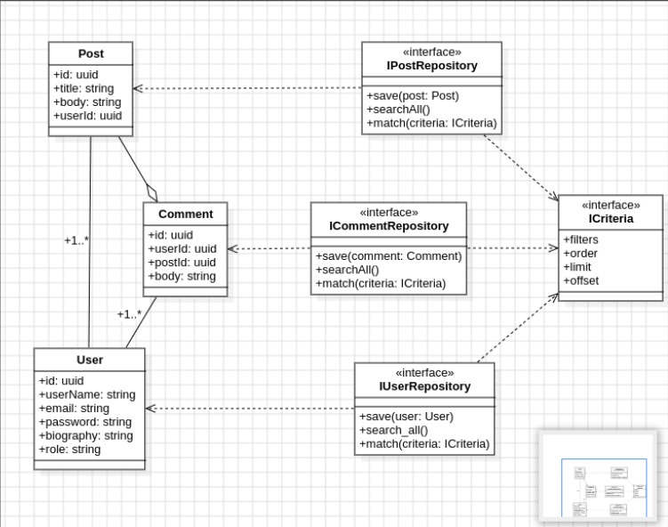
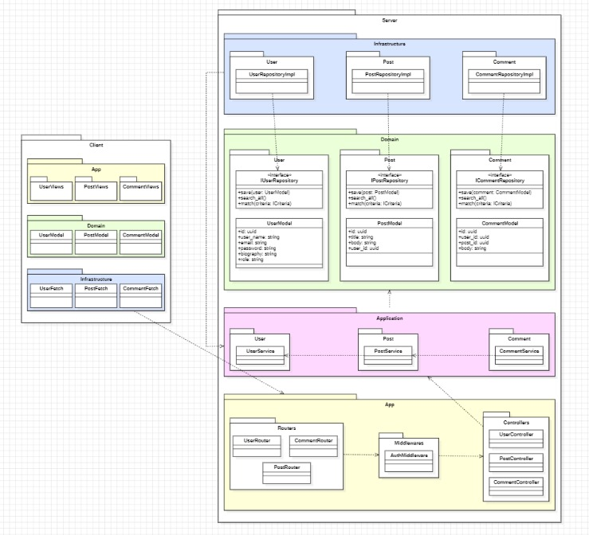
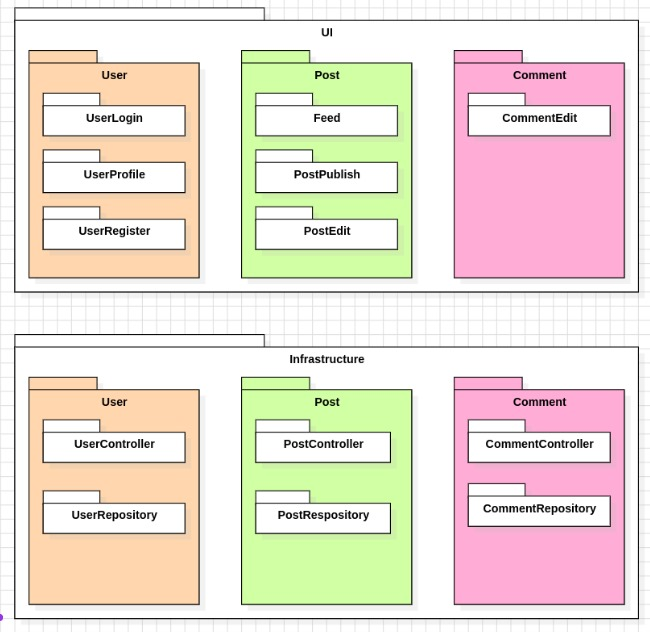
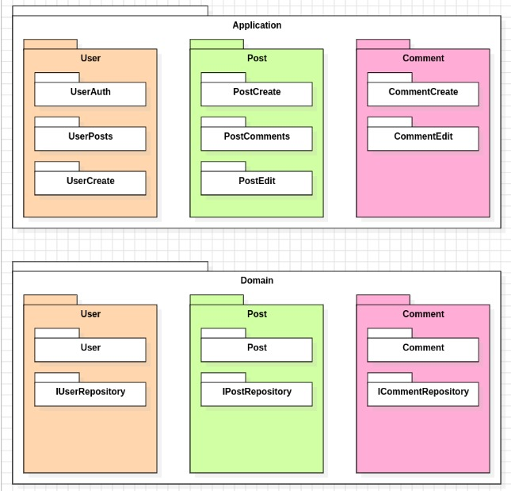
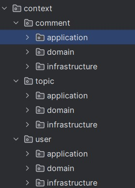
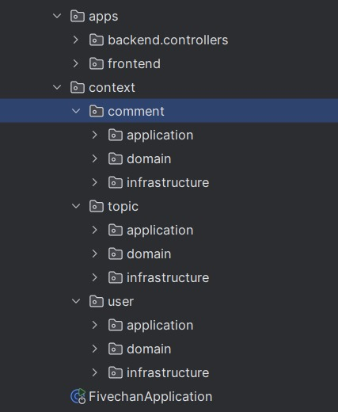

# FiveChan
___


# Propósito
El propósito del proyecto "Five Chan" es desarrollar una plataforma de foro universitario que
permita a los estudiantes crear y publicar temas de discusión, así como comentar en ellos.
Este foro facilita la interacción y el intercambio de ideas entre los estudiantes, además de proporcionar
herramientas de moderación para mantener la calidad del contenido y el cumplimiento de las normas del foro.
# Funcionalidades
## Publicación de Temas:

- Crear y publicar nuevos temas de discusión.
- Categorizar temas bajo diferentes secciones del foro.
## Comentario en Temas:

- Comentar en temas publicados por otros usuarios.
- Editar y eliminar comentarios propios.
## Moderación de Contenidos:

- Censurar y eliminar temas inapropiados.
- Editar y eliminar comentarios inapropiados.
## Gestión de Usuarios por Moderadores:

- Suspender temporalmente a usuarios que infrinjan las normas.
- Banear permanentemente a usuarios en casos de infracciones graves.


## Modelo de Dominio
El modelo de dominio del proyecto incluye las siguientes entidades principales:

- Usuario: Representa a los estudiantes registrados en el foro.
- Moderador: Usuario con privilegios adicionales para moderar el contenido del foro.
- Tema: Discusión iniciada por un usuario, con título y contenido.
- Comentario: Respuesta o aportación de un usuario a un tema existente.

## Arquitectura y Patrones


## Modelo de Dominio:


## Arquitectura y Patrones:


Paquetes




## Practicas de codificación limpia:

### Clean Code

#### 1. Nombrado Significativo

Los nombres de las clases y métodos son claros y descriptivos.

**Ejemplo:**

```java
public class UserEntity {
    @Id
    private UUID id;
    private String name;
    private String description;
    private String avatar;
    private String email;

    // Métodos
}
```
#### 2. Funciones Pequeñas y Centradas
Cada método realiza una tarea específica, lo que facilita su comprensión y mantenimiento.

```java
@Override
@Transactional
public void save(User user) {
    UserEntity userEntity = UserEntity.fromDomain(user);
    entityManager.persist(userEntity);
}

@Override
public User findById(UUID id) {
    UserEntity userEntity = entityManager.find(UserEntity.class, id);
    return userEntity != null ? userEntity.toDomain() : null;
}

```
#### 3. Evitar commentarios inncesarios
El código es autoexplicativo, lo que minimiza la necesidad de comentarios adicionales.

```java
@Override
public User findByUsername(String username) {
    try {
        UserEntity userEntity = entityManager.createQuery("SELECT u FROM UserEntity u WHERE u.name = :username", UserEntity.class)
                .setParameter("username", username)
                .getSingleResult();
        return userEntity.toDomain();
    } catch (jakarta.persistence.NoResultException e) {
        return null;
    }
}

```
## Estilos de Programación aplicados


#### 1. Cookbook

Este estilo implica tener recetas específicas para realizar tareas comunes. Los métodos
en `JpaUserRepository` siguen un patrón repetitivo y bien definido para las operaciones CRUD.

**Ejemplo:**

```java
@Override
@Transactional
public void save(User user) {
    UserEntity userEntity = UserEntity.fromDomain(user);
    entityManager.persist(userEntity);
}

@Override
public User findById(UUID id) {
    UserEntity userEntity = entityManager.find(UserEntity.class, id);
    return userEntity != null ? userEntity.toDomain() : null;
}
```
#### 2. Pipeline
Este estilo se refiere a procesar datos a través de una serie de pasos o etapas. En la conversión entre User y UserEntity.
```java

public User toDomain() {
    return new User(id, name, description, avatar, email);
}

public static UserEntity fromDomain(User user) {
    return new UserEntity(user.getId(), user.getName(), user.getDescription(), user.getAvatar(), user.getEmail());
}
```

#### 3. Restful

```Java
@RestController
@RequestMapping("/users")
public class UserController {
    private final UserService userService;

    @Autowired
    public UserController(UserService userService) {
        this.userService = userService;
    }

    @PostMapping
    public void createUser(@RequestBody UserDTO user) {
        UUID id = UUID.randomUUID();
        this.userService.createUser(id, user.getName(), user.getDescription(), user.getAvatar(), user.getEmail());
    }
}
```
## Principios SOLID

#### 1. Principio de Responsabilidad Única
Cada clase tiene una única responsabilidad.

```java
@Service
public class UserService {
    private final UserRepository userRepository;

    @Autowired
    public UserService(UserRepository userRepository) {
        this.userRepository = userRepository;
    }

    public void createUser(UUID id, String name, String description, String avatar, String email) {
        this.userRepository.save(new User(id, name, description, avatar, email));
    }
}

```
```java
@Repository
public class JpaUserRepository implements UserRepository {
    @PersistenceContext
    protected EntityManager entityManager;

    @Override
    @Transactional
    public void save(User user) {
        UserEntity userEntity = UserEntity.fromDomain(user);
        entityManager.persist(userEntity);
    }
}

```

#### 2. Open/Closed Principle (OCP)
Las clases son abiertas para extenderse pero cerradas para modificarse.

```java
public interface UserRepository {
    void save(User user);
    List<User> findAll();
    User findById(UUID id);
    User findByUsername(String username);
    User findByEmail(String email);
    void deleteById(UUID id);
    void updateById(UUID id, User user);
}
```

```java
@Repository
public class JpaUserRepository implements UserRepository {
    @PersistenceContext
    protected EntityManager entityManager;

    @Override
    @Transactional
    public void save(User user) {
        UserEntity userEntity = UserEntity.fromDomain(user);
        entityManager.persist(userEntity);
    }
}
```

## Conceptos DDD

### Entidades:
Las entidades son objetos del dominio que tienen una identidad única que se mantiene a lo
largo del tiempo, incluso si su estado cambia. Se definen por su continuidad y unicidad, no solo
por sus atributos. Un ejemplo podría ser un usuario en un sistema, que se identifica de manera única
por un ID de usuario.

**Ejemplo de Entidades en `Topic.java`:**
```java
package com.fivechan.forum.context.topic.domain;

import java.util.UUID;

public class Topic {
    private UUID id;
    private UUID userId;
    private String title;
    private String content;

    public Topic(UUID id, UUID userId, String title, String content) {
        this.id = id;
        this.userId = userId;
        this.title = title;
        this.content = content;
    }

    public Topic(UUID userId, String title, String content) {
        this.id = UUID.randomUUID();
        this.userId = userId;
        this.title = title;
        this.content = content;
    }

    public UUID getId() {
        return id;
    }

    public void setId(UUID id) {
        this.id = id;
    }

    public UUID getUserId() {
        return userId;
    }

    public void setUserId(UUID userId) {
        this.userId = userId;
    }

    public String getTitle() {
        return title;
    }

    public void setTitle(String title) {
        this.title = title;
    }

    public String getContent() {
        return content;
    }

    public void setContent(String content) {
        this.content = content;
    }
}
```

### Servicios de Dominio:
Los servicios de dominio son operaciones que no pertenecen a una entidad o a un objeto de valor, pero que
son relevantes para el dominio. Estos servicios encapsulan lógica que involucra a varias entidades o que
no encaja claramente en una sola entidad. Un servicio de dominio podría ser una operación de transferencia de
dinero entre cuentas bancarias.

**Ejemplo de Servicio en `CommentService.java`:**
```java
package com.fivechan.forum.context.comment.application;

import com.fivechan.forum.context.comment.domain.Comment;
import com.fivechan.forum.context.comment.domain.CommentRepository;
import org.springframework.beans.factory.annotation.Autowired;
import org.springframework.stereotype.Service;

import java.text.MessageFormat;

import java.util.UUID;


@Service
public class CommentService {

    private final CommentRepository commentRepository;

    @Autowired
    public CommentService(CommentRepository commentRepository) {
        this.commentRepository = commentRepository;
    }

    public void createComment(UUID userId, UUID topicId, String content) {
        Comment comment = new Comment(userId, topicId, content);
        this.commentRepository.save(comment);
    }

    public void deleteComment(UUID commentId) {
        Comment comment = this.commentRepository.findById(commentId)
                .orElseThrow(() -> new CommentNotFoundException(MessageFormat.format("Comment not found with id: {0}", commentId)));
        this.commentRepository.delete(comment);
    }

    public void editComment(UUID commentId, String newContent) {
        Comment comment = this.commentRepository.findById(commentId)
                .orElseThrow(() -> new CommentNotFoundException("Comment not found with id: " + commentId));
        comment.setContent(newContent);
        this.commentRepository.update(comment);
    }
}

```
### Modulos:
Los módulos, también conocidos como agregados, son grupos de entidades y objetos de valor que están fuertemente
relacionados y que deben ser tratados como una sola unidad de coherencia. Los módulos ayudan a mantener la
integridad del dominio y facilitan su gestión y evolución. Un ejemplo podría ser un módulo de "Pedido"
que agrupa las entidades "Pedido" y "Línea de Pedido".



### Repositorios:
Los repositorios son responsables de proporcionar acceso a las colecciones de objetos de entidad. Actúan como intermediarios entre la capa de dominio y la capa de persistencia, permitiendo a las aplicaciones recuperar y almacenar entidades sin conocer los detalles de cómo se manejan estos datos. Un repositorio podría ser responsable de gestionar el acceso a la base de datos para las entidades de "Usuario".

**Ejemplo de Repositorio en `JpaCommentRepository.java`:**
```java
package com.fivechan.forum.context.comment.infrastructure;

import com.fivechan.forum.context.comment.domain.Comment;
import com.fivechan.forum.context.comment.domain.CommentEntity;
import com.fivechan.forum.context.comment.domain.CommentRepository;
import jakarta.persistence.EntityManager;
import jakarta.persistence.PersistenceContext;
import jakarta.persistence.TypedQuery;
import org.springframework.stereotype.Repository;

import java.util.List;
import java.util.Optional;
import java.util.UUID;
import java.util.stream.Collectors;

@Repository
public class JpaCommentRepository implements CommentRepository {
    @PersistenceContext
    protected EntityManager entityManager;

    @Override
    public void save(Comment comment) {
        CommentEntity commentEntity = CommentEntity.fromDomain(comment);
        entityManager.persist(commentEntity);
    }

    @Override
    public void update(Comment comment) {
        CommentEntity commentEntity = CommentEntity.fromDomain(comment);
        entityManager.merge(commentEntity);
    }

    @Override
    
    public void delete(Comment comment) {
        CommentEntity commentEntity = CommentEntity.fromDomain(comment);
        entityManager.remove(commentEntity);
    }

    @Override
    public Optional<Comment> findById(UUID id) {
        CommentEntity entity = entityManager.find(CommentEntity.class, id);
        return Optional.ofNullable(entity != null ? entity.toDomain() : null);
    }

    @Override
    public List<Comment> findAll() {
        TypedQuery<CommentEntity> query = entityManager.createQuery("FROM CommentEntity", CommentEntity.class);
        return query.getResultList().stream()
                .map(CommentEntity::toDomain)
                .collect(Collectors.toList());
    }

    @Override
    public List<Comment> findByUserId(UUID userId) {
        TypedQuery<CommentEntity> query = entityManager.createQuery(
                "SELECT c FROM CommentEntity c WHERE c.userId = :userId", CommentEntity.class);
        query.setParameter("userId", userId);
        return query.getResultList().stream()
                .map(CommentEntity::toDomain)
                .collect(Collectors.toList());
    }

    @Override
    public List<Comment> findByTopicId(UUID topicId) {
        TypedQuery<CommentEntity> query = entityManager.createQuery(
                "SELECT c FROM CommentEntity c WHERE c.topicId = :topicId", CommentEntity.class);
        query.setParameter("topicId", topicId);
        return query.getResultList().stream()
                .map(CommentEntity::toDomain)
                .collect(Collectors.toList());
    }
}

```

### Arquitectura en capas:
La arquitectura en capas es una estructura organizativa que divide el sistema en capas con responsabilidades
específicas y bien definidas. En DDD, estas capas comúnmente incluyen la capa de presentación (interfaz de usuario), la
capa de aplicación (lógica de la aplicación), la capa de dominio (lógica del negocio) y la capa de
infraestructura (acceso a datos, servicios externos). Esta arquitectura ayuda a separar las
preocupaciones y facilita el mantenimiento y la escalabilidad del sistema.



#### Estilos de programación

##### 1. Restful

```Java
@RestController
@RequestMapping("/topic")
public class TopicController {
    private final TopicService topicService;

    @Autowired
    public TopicController(TopicService topicService) {
        // ...
    }

    @PostMapping
    public  void createTopic(@RequestBody TopicDTO topic) {
        // ...
    }
}
```

##### 2. Cookbook

Este estilo implica tener recetas específicas para realizar tareas comunes. Los métodos en `JpaUserRepository` siguen un patrón repetitivo y bien definido para las operaciones CRUD.

**Ejemplo:**

```java
@Override
@Transactional
public void save(User user) {
    UserEntity userEntity = UserEntity.fromDomain(user);
    entityManager.persist(userEntity);
}

@Override
public User findById(UUID id) {
    UserEntity userEntity = entityManager.find(UserEntity.class, id);
    return userEntity != null ? userEntity.toDomain() : null;
}
```

##### 3. Pipeline
Este estilo se refiere a procesar datos a través de una serie de pasos o etapas. En la conversión entre User y UserEntity.
```java

public User toDomain() {
    return new User(id, name, description, avatar, email);
}

public static UserEntity fromDomain(User user) {
    return new UserEntity(user.getId(), user.getName(), user.getDescription(), user.getAvatar(), user.getEmail());
}
```

#### 4. Persistent-Tables

```java
@Entity
public class TopicEntity {
    @Id
    private UUID id;
    private UUID userId;
    private String title;
    private String content;

    // ...
}
```

```java
@Repository
public class JpaTopicRepository implements TopicRepository {
    @PersistenceContext
    protected EntityManager entityManager;

    // ...
}
```
